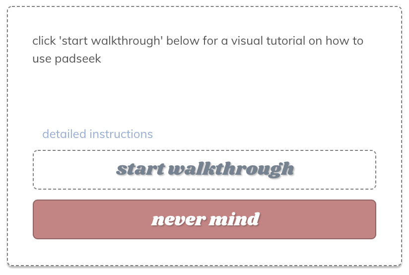
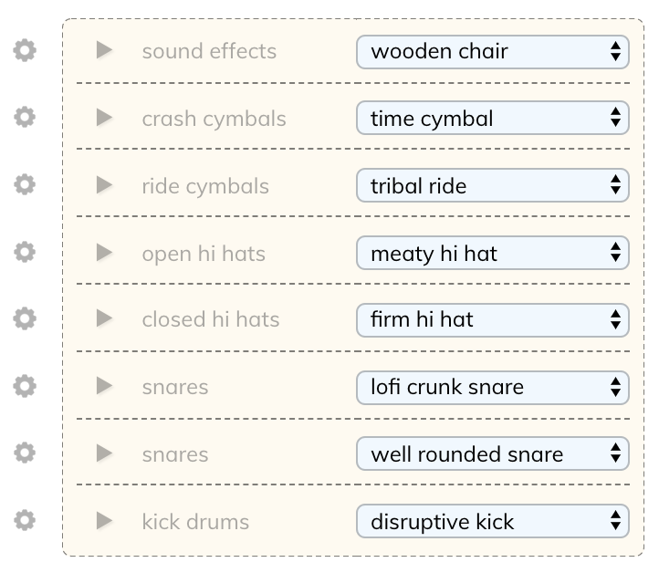
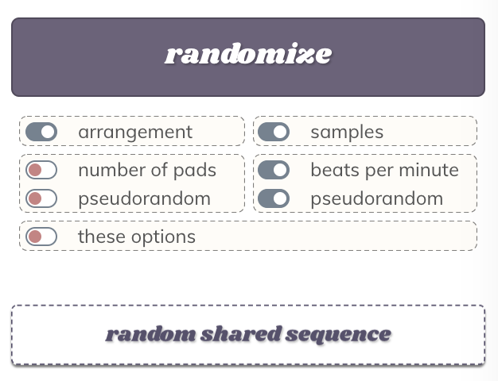

# padseek

 

 

**introduction**

>padseek is a module-based drum sequencer made with love and javascript. this is an ongoing project, so it might be wonky here and there, but please feel free to check back in for more features and add-ons!

>click "what is this?" in the bottom left corner of padseek for a visual walkthrough

visual | how to operate
--- | ---
 | _choose a tempo for your sequence via the 'tempo (beats per minute)' field inside of the 'sequence controls' module_  _activate your selected pad pieces inside the 'drum pad' module (optionally: duplicate existing pads)_  _choose the drum samples that fit your sequence through the 'sample selection' module_  _press 'play sequence' or 'pause sequence' to do exactly what that says_  _see modules below_  **keyboard shortcuts: bottom of this document**

 [click here to start building your own drum sequences](https://aaronchapman.github.io/padseek)

---

**modules**

## sequence controls

visual | how to operate
--- | ---
 | **`play / pause sequence:`** _this button allows you to control whether or not the sequence is running_  **`clear selections:`** _this button will reset all of the pad piece selections you've made_  **`tempo (beats per minute):`** _this field controls the speed at which your drum sequence will run_  _you can enter a tempo value, or calculate and set one using the keyboard shortcuts outlined in the tempo module_

## sample selection

visual | how to operate
--- | ---
 | **`drum sample options:`** _each row of this module houses a different set of drum samples for you to choose from_  _you can make your sample selections at anytime during the sequence_  **`sample sampler:`** _clicking on the '▶' icon will play the currently selected option for that sample type_
 | **`sample swapper:`** _clicking on the '⏣' icon will allow you to swap that row's sample type with a new one_

## drum pads

visual | how to operate
--- | ---
 | **`duplicate pad:`** _this button will duplicate the pad beneath it directly in front of it (the maximum sequence size is 32 pads)_  **`remove pad:`** _this button will remove the pad beneath it_  **`pad pieces:`** _activating a pad piece will result in that piece's row triggering the selected sample_  **`duplicate sequence:`** _this button will duplicate the entire pad sequence (the maximum sequence size that can be duplicated is 16 pads)_  **`remove all pads:`** _this button will remove all pads except the first_

## randomization module

visual | how to operate
--- | ---
 | **`randomize:`** _this button will randomize the sequence according to the randomization options you have selected_  **`random shared sequence:`** _this button will load a random sequence that has been publicly shared_

option | description | pseudo*
--- | --- | ---
arrangement | randomly arranges all pad pieces | no
samples | selects random sample options | no
number of pads | generates a random sequence size (number of drum pads) | yes
beats per minute | randomizes the sequence tempo | yes
these options | switches random randomization options on / off | default

*pseudorandom options choose from a set a predefined values that follow popular sequence structures

## shared sequences

visual | how to operate
--- | ---
 | **`share sequence:`** _this button will prompt you to name your sequence before sharing its data with the community_  **`browse recently shared sequences:`** _click on any of the named buttons under this section to load a sequence that has been shared by another user_

## saved sequences

visual | how to operate
--- | ---
 | **`load sequences:`** _after entering the name of an existing user with valid data, pressing this button will load up that user's personally saved sequences_  **`save current sequence:`** _pressing this button will save the current sequence for the user that was provided_  **`sequences saved by loaded user:`** _uhh... a list... of sequences... saved... by the... currently... loaded... user... ahem..._

## tempo tool

visual | how to operate
--- | ---
 | **`to operate:`** _the bpm display inside the tempo module displays the tempo currently being calculated_  _hit the [ t ] key on each beat to get the number of beats per minute_  _hit the [ r ] key to reset the bpm counter_  _hit the [ s ] key to set the sequence tempo to the newly calculated bpm_

---

**`keyboard shortcuts`**

key | shortcut
--- | ---
`[ c ]` | open or close shortcuts menu
`[ p ]` | play or pause your sequence
`[ x ]` | clear all of your selected pad pieces
`[ z ]` | randomize sequence with current randomization options
`[ m ]` | share current sequence
`[ j ]` | copy the sequence data in JSON format to your clipboard
`[ t ]` | calculate tempo (press repeatedly)
`[ r ]` | reset calculated tempo
`[ s ]` | set sequence tempo from calculated tempo