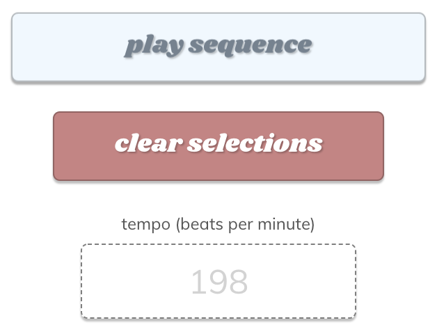
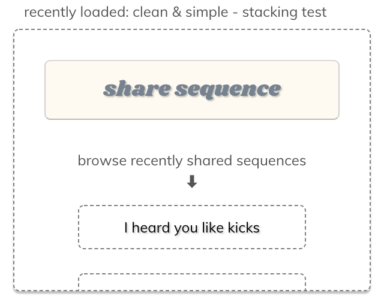
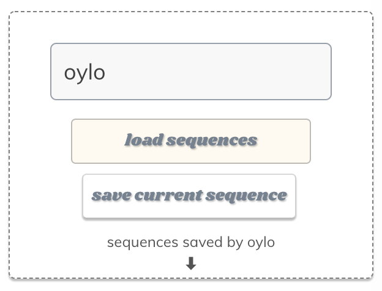
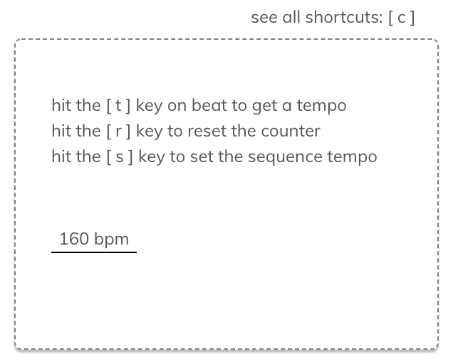

# p a d s e e k

 

 

>padseek is a module-based drum sequencer made with love and javascript. this is an ongoing project, so it might be wonky here and there, but please feel free to check back in for more features and add-ons!

. . .

**`how to operate`**

>click "what is this?" in the bottom left corner of padseek for a visual walkthrough

- choose a tempo for your sequence via the 'tempo (beats per minute)' field inside of the 'sequence controls' module
- activate your selected pad pieces inside the 'drum pad' module (optionally: duplicate existing pads)
- choose the drum samples that fit your sequence through the 'sample selection' module
- press 'play sequence' or 'pause sequence' to do exactly what that says
- see modules below

**`keyboard shortcuts`**

key | shortcut
--- | ---
`[ c ]` | open / close shortcuts menu
`[ p ]` | play / pause sequence
`[ x ]` | clear pad piece selections
`[ z ]` | randomize sequence
`[ m ]` | share current sequence
`[ t ]` | calculate tempo
`[ r ]` | reset calculated tempo
`[ s ]` | set sequence tempo

---
## sequence controls

-**play / pause sequence:**
- this button allows you to control whether or not the sequence is running

-**clear selections:**
- this button will reset all of the pad piece selections you've made

-**tempo (beats per minute):**
- this field controls the speed at which your drum sequence will run
- you can enter a tempo value, or calculate and set one using the keyboard shortcuts outlined in the tempo module

---
## sample selection

-**drum sample options:**
- each row of this module houses a different set of drum samples for you to choose from
- you can make your sample selections at anytime during the sequence

-**sample sampler:**
- clicking on the '▶' icon will play the currently selected option for that sample type

-**sample swapper:**
- clicking on the '⏣' icon will allow you to swamp that row's sample type with a new one

---
## drum pads

-**duplicate pad:**
- this button will duplicate the pad beneath it directly in front of it (the maximum sequence size is 32 pads)

-**remove pad:**
- this button will remove the pad beneath it

-**pad pieces:**
- activating a pad piece will result in that piece's row triggering the selected sample

-**duplicate sequence:**
- this button will duplicate the entire pad sequence (the maximum sequence size that can be duplicated is 16 pads)

-**remove all pads:**
- this button will remove all pads except the first

---
## randomization module

-**randomize:**
- this button will randomize the sequence according to the randomization options you have selected

**`randomization options`**

*pseudorandom options choose from a set a predefined values that follow popular sequence structures

option | description | pseudo*
--- | --- | ---
arrangement | randomly arranges pad pieces | no
samples | selects random sample options | no
number of pads | generates a random sequence size | yes
beats per minute | randomizes the sequence tempo | yes
these options | switches random randomization options on / off | no

---
## shared sequences

-**share sequence:**
- this button will prompt you to name your sequence before sharing its data with the community

-**browse recently shared sequences:**
- click on any of the named buttons under this section to load a sequence that has been shared by another user

---
## saved sequences

-**load sequences:**
- after entering the name of an existing user with valid data, pressing this button will load up that user's personally saved sequences

-**save current sequence:**
- pressing this button will save the current sequence for the user that was provided

-**sequences saved by loaded user:**
- uhh... a list... of sequences... saved... by the... currently... loaded... user... ahem...

. . .

**`internal commands`**

key | shortcut
--- | ---
`[ j ]` | copy sequence data to clipboard (JSON)
`[ o ]` | coming soon

---
## tempo tool

-**to operate:**
- the bpm display inside the tempo module displays the tempo currently being calculated
- hit the [ t ] key on each beat to get the number of beats per minute
- hit the [ r ] key to reset the bpm counter
- hit the [ s ] key to set the sequence tempo to the newly calculated bpm